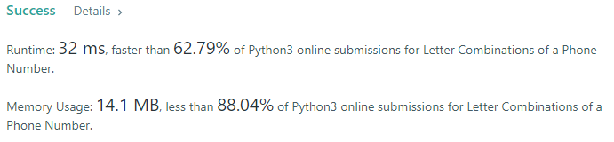

- Given a string containing digits from 2-9 inclusive, return all possible letter combinations that the number could represent. Return the answer in any order.  

- A mapping of digit to letters (just like on the telephone buttons) is given below. Note that 1 does not map to any letters.
### Example 1:
```
Input: digits = "23"
Output: ["ad","ae","af","bd","be","bf","cd","ce","cf"]
```

### Constraints:
- 0 <= digits.length <= 4
- digits[i] is a digit in the range ['2', '9'].

### Solution: 
```python
class Solution(object):
    def letterCombinations(self, digits):
        dig_dict = {str(i): [3] for i in range(2, 10)}
        dig_dict['7'] = [4]
        dig_dict['9'] = [4]
        i = 97
        # mask buttom dictionary
        for d in dig_dict:
            for j in range(dig_dict[d][0]):
                dig_dict[d].append(chr(i))
                i += 1
        ans = []
        ans_dig = []
        for d in digits:
            ans_dig.append(dig_dict[d][1:])
        total_len = 1
        # find result length
        for x in ans_dig[1:]:
            total_len *= len(x)
        # count last distinct result length
        _ = 1
        for j, x in enumerate(ans_dig):
            for i, y in enumerate(x):
                if j == 0:
                    # init
                    for a in range(int(total_len)):
                        ans.append(y)
                else:
                    # add at distinct result
                    for r in range(_):
                        # for next distinct result
                        for b in range(int(total_len) // len(x)):
                            ans[i*(int(total_len) // len(x))+b+r*int(total_len)] += y
            if j > 0:
                total_len = total_len / len(x)
            _ *= len(x)

        return ans
```

### Result
