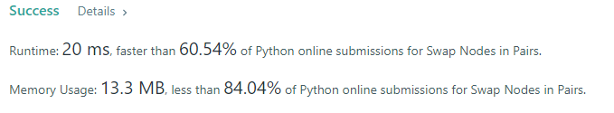

- Given a linked list, swap every two adjacent nodes and return its head.

### Example 1:
```
Input: head = [1,2,3,4]
Output: [2,1,4,3]
```

### Solution: 
```python
# Definition for singly-linked list.
class ListNode(object):
    def __init__(self, val=0, next=None):
        self.val = val
        self.next = next
class Solution(object):
    def swapPairs(self, head):
        def length(ln):
            c = 0
            while ln:
                c += 1
                ln = ln.next
            return c
        _ = ListNode(0, head)
        ans = _
        counter = head
        len_head = length(head)
        if len_head == 0:
            return ListNode("")
        elif len_head == 1:
            return head
        if len_head % 2 == 0:
            # tmp is used to save the odd th number
            tmp = _
            while counter:
                tmp = counter.val
                counter = counter.next
                ans.next = ListNode(counter.val)
                ans = ans.next
                ans.next = ListNode(tmp)
                ans = ans.next
                counter = counter.next
        else:
            # if odd, just add the last number in the tail
            tmp = _
            while counter.next:
                tmp = counter.val
                counter = counter.next
                ans.next = ListNode(counter.val)
                ans = ans.next
                ans.next = ListNode(tmp)
                ans = ans.next
                counter = counter.next
            ans.next = ListNode(counter.val)
        return _.next
```

### Result
