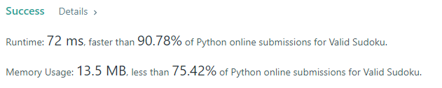

### Example 1:
```
Input: board = 
[["5","3",".",".","7",".",".",".","."]
,["6",".",".","1","9","5",".",".","."]
,[".","9","8",".",".",".",".","6","."]
,["8",".",".",".","6",".",".",".","3"]
,["4",".",".","8",".","3",".",".","1"]
,["7",".",".",".","2",".",".",".","6"]
,[".","6",".",".",".",".","2","8","."]
,[".",".",".","4","1","9",".",".","5"]
,[".",".",".",".","8",".",".","7","9"]]
Output: true
```

### Example 2:
```
Input: board = 
[["8","3",".",".","7",".",".",".","."]
,["6",".",".","1","9","5",".",".","."]
,[".","9","8",".",".",".",".","6","."]
,["8",".",".",".","6",".",".",".","3"]
,["4",".",".","8",".","3",".",".","1"]
,["7",".",".",".","2",".",".",".","6"]
,[".","6",".",".",".",".","2","8","."]
,[".",".",".","4","1","9",".",".","5"]
,[".",".",".",".","8",".",".","7","9"]]
Output: false
Explanation: Same as Example 1, except with the 5 in the top left corner being modified to 8. Since there are two 8's in the top left 3x3 sub-box, it is invalid.
```

### Solution: 
```python
class Solution(object):
    def isValidSudoku(self, board):
        def checksquare(sudoku):
            for i in range(3):
                for j in range(3):
                    res = []
                    # add the square element into res list
                    for k in range(3):
                        res += sudoku[k+j*3][i*3:(i+1)*3]
                    counter = 0
                    _ = set()
                    for r in res:
                        if r != ".":
                            counter += 1
                            _.add(r)
                    # have the same number
                    if counter != len(_):
                        return False
            return True

        ans = True
        if not checksquare(board):
            ans = False
            return ans
        for b in board:
            _ = set()
            counter = 0
            for i in b:
                if i != ".":
                    counter += 1
                    _.add(i)
            # have the same number
            if counter != len(_):
                ans = False
                return ans
        for x in range(9):
            _ = set()
            counter = 0
            for y in range(9):
                if board[y][x] != ".":
                    counter += 1
                    _.add(board[y][x])
                if counter != len(_):
                    ans = False
                    return ans
        return ans
```

### Result
