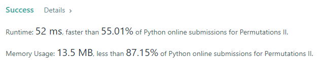

- Given a collection of numbers, nums, that might contain duplicates, return all possible unique permutations in any order.

### Example 1:
```
Input: nums = [1,1,2]
Output:
[[1,1,2],
 [1,2,1],
 [2,1,1]]
```

### Example 2:
```
Input: nums = [1,2,3]
Output: [[1,2,3],[1,3,2],[2,1,3],[2,3,1],[3,1,2],[3,2,1]]
```

### Solution: 
```python
class Solution(object):
    def permuteUnique(self, nums):
        def nextNum(n):
            array = n[:]
            i = max(i for i in range(1, len(array)) if array[i - 1] < array[i])
            j = max(j for j in range(i, len(array)) if array[j] > array[i - 1])
            array[j], array[i - 1] = array[i - 1], array[j]
            array[i:] = reversed(array[i:])
            return array

        def factorial(n):
            r = 1
            for i in range(1, n+1):S
                r *= i
            return r

        _ = {str(x): 0 for x in nums}
        for n in nums:
            _[str(n)] += 1
        # counter : total permutation number
        counter = 1
        for i in range(1, len(nums)+1):
            counter *= i
        for d in _:
            counter /= factorial(_[d])
        ans = []
        nums = sorted(nums)
        ans.append(nums)
        # find next bigger number
        for j in range(int(counter)-1):
            nums  = nextNum(nums)
            ans.append(nums)

        return ans
```

### Result
