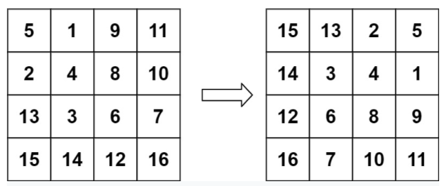
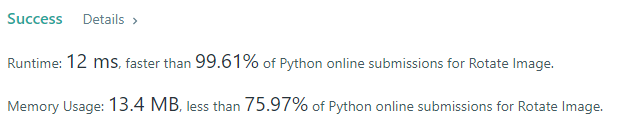

- You are given an n x n 2D matrix representing an image, rotate the image by 90 degrees (clockwise).

- You have to rotate the image in-place, which means you have to modify the input 2D matrix directly. DO NOT allocate another 2D matrix and do the rotation.

### Example 1:
```
Input: matrix = [[1,2,3],[4,5,6],[7,8,9]]
Output: [[7,4,1],[8,5,2],[9,6,3]]
```

### Example 2:

```
Input: matrix = [[5,1,9,11],[2,4,8,10],[13,3,6,7],[15,14,12,16]]
Output: [[15,13,2,5],[14,3,4,1],[12,6,8,9],[16,7,10,11]]
```

### Solution: 
```python
class Solution(object):
    def rotate(self, matrix):
        n = len(matrix)
        # how many square
        c = n // 2
        # square : outside to inside
        for i in range(c):
            # left bottom right side for square
            for x in range(3):
                # replace : left side switch with top side 
                # and bottom, and so on
                for y in range(n-2*i-1):
                    if x == 0:
                        _ = matrix[y+i][-1-i]
                        matrix[y+i][-1-i] = matrix[0+i][y+i]
                        matrix[0+i][y+i] = _
                    elif x == 1:
                        _ = matrix[-1-i][-1-y-i]
                        matrix[-1-i][-1-y-i] = matrix[0+i][y+i]
                        matrix[0+i][y+i] = _
                    elif x == 2:
                        _ = matrix[-1-y-i][0+i]
                        matrix[-1-y-i][0+i] = matrix[0+i][y+i]
                        matrix[0+i][y+i] = _
        return matrix
```

### Result
