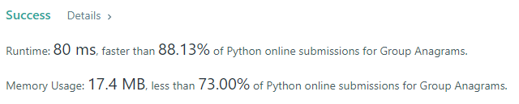

- Given an array of strings strs, group the anagrams together. You can return the answer in any order.

- An Anagram is a word or phrase formed by rearranging the letters of a different word or phrase, typically using all the original letters exactly once.

### Example 1:
```
Input: strs = [""]
Output: [[""]]
```

### Example 2:
```
Input: strs = ["eat","tea","tan","ate","nat","bat"]
Output: [["bat"],["nat","tan"],["ate","eat","tea"]]
```

### Solution: 
```python
class Solution(object):
    def groupAnagrams(self, strs):
        ans = []
        _ = {}
        for s in strs:
            tmp = "".join(sorted(list(s)))
            if tmp not in _:
                _[tmp] = [s]
            else:
                _[tmp].append(s)
        for i in _:
            ans.append(_[i])
        return ansa

```

### Result
