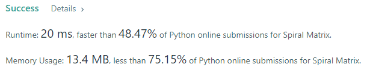

- Given an m x n matrix, return all elements of the matrix in spiral order.

### Example 1:
```
Input: matrix = [[1,2,3],[4,5,6],[7,8,9]]
Output: [1,2,3,6,9,8,7,4,5]
```

### Example 2:
```
Input: matrix = [[1,2,3,4],[5,6,7,8],[9,10,11,12]]
Output: [1,2,3,4,8,12,11,10,9,5,6,7]
```

### Solution: 
```python
class Solution(object):
    def spiralOrder(self, matrix):
        def direction(n):
            step = [(0, 1), (1,0), (0, -1), (-1, 0)]
            return step[n % 4]
        n = len(matrix)
        m = len(matrix[0])
        en = n*m
        ans = []
        i = 0
        j = 0
        counter = []
        c = 0
        while len(ans) < en: 
            if (i, j) not in counter and 0<=i<n and 0<=j<m:
                tmp = matrix[i][j]
                counter.append((i, j))
                ans.append(tmp)
                d = direction(c)
                i += d[0]
                j += d[1]
            # change direction
            else:
                d = direction(c)
                i -= d[0]
                j -= d[1]
                c += 1
                d = direction(c)
                i += d[0]
                j += d[1]

        return ans
```

### Result
