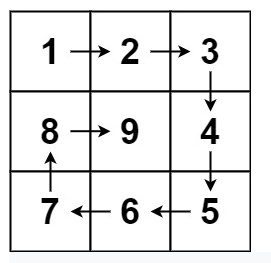

- Given a positive integer n, generate an n x n matrix filled with elements from 1 to n2 in spiral order.

### Example 1:

```
Input: n = 3
Output: [[1,2,3],[8,9,4],[7,6,5]]
```

### Example 2:
```
Input: n = 1
Output: [[1]]
```

### Solution: 
```python
class Solution(object):
    def generateMatrix(self, n):
        def direction(n):
            step = [(0, 1), (1,0), (0, -1), (-1, 0)]
            return step[n % 4]
        en = n**2
        ans = [[0 for j in range(n)] for i in range(n)]
        res = [i for i in range(1, en+1)]
        i = 0
        j = 0
        # stopper
        counter = []
        # change direction
        c = 0
        _ = 0
        while _ < en: 
            if (i, j) not in counter and 0<=i<n and 0<=j<n:
                ans[i][j] = res[_]
                _ += 1
                counter.append((i, j))
                d = direction(c)
                i += d[0]
                j += d[1]
            # change direction
            else:
                d = direction(c)
                i -= d[0]
                j -= d[1]
                c += 1
                d = direction(c)
                i += d[0]
                j += d[1]

        return ans
```