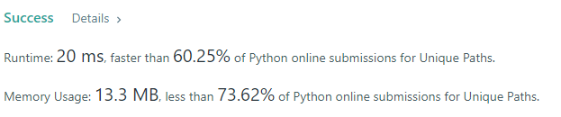

- A robot is located at the top-left corner of a m x n grid (marked 'Start' in the diagram below).

- The robot can only move either down or right at any point in time. The robot is trying to reach the bottom-right corner of the grid (marked 'Finish' in the diagram below).

- How many possible unique paths are there?

### Example 1:
```
Input: m = 3, n = 7
Output: 28
```

### Example 2:
```
Input: m = 3, n = 2
Output: 3
Explanation:
From the top-left corner, there are a total of 3 ways to reach the bottom-right corner:
1. Right -> Down -> Down
2. Down -> Down -> Right
3. Down -> Right -> Down
```

### Solution: 
```python
class Solution(object):
    def uniquePaths(self, m, n):
        def factorial(num):
            res = 1
            for i in range(1, num+1):
                res *= i
            return res
        def numPermutation(x, y):
            return factorial(x+y)/(factorial(x)*factorial(y))
        # permutation of down and right
        ans = numPermutation(m-1, n-1)
        return ans
```

### Result
