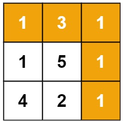

- Given a m x n grid filled with non-negative numbers, find a path from top left to bottom right, which minimizes the sum of all numbers along its path.

- Note: You can only move either down or right at any point in time.

### Example 1:

```
Input: grid = [[1,3,1],[1,5,1],[4,2,1]]
Output: 7
Explanation: Because the path 1 → 3 → 1 → 1 → 1 minimizes the sum.
```

### Example 2:
```
Input: grid = [[1,2,3],[4,5,6]]
Output: 12
```

### Solution: 
```python
class Solution(object):
    def minPathSum(self, grid):
        ans = 0
        m = len(grid)
        n = len(grid[0])
        # possible number matrix
        ans = [[0 for i in range(n)]for j in range(m)]
        ans[0][0] = grid[0][0]
        for x in range(m):
            tmp = min(ans[x])
            for y in range(n):
                # only compute min of ans[x]
                if ans[x][y] != tmp:
                    continue
                if x-1<0 and y-1<0:
                    _ = 0
                else:
                    # slow
                    _ = min(grid[x][y]+ans[x-1][y] if x-1 >= 0 else grid[x][y]+ans[x][y-1], grid[x][y]+ans[x][y-1] if y-1 >= 0 else grid[x][y]+ans[x-1][y])
                ans[x][y] += _
        return ans[-1][-1]
```