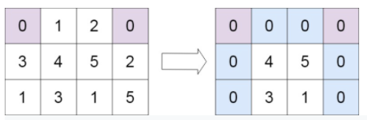

- Given an m x n matrix. If an element is 0, set its entire row and column to 0. Do it in-place.

### Example 1:
```
Input: matrix = [[1,1,1],[1,0,1],[1,1,1]]
Output: [[1,0,1],[0,0,0],[1,0,1]]
```

### Example 2:

```
Input: matrix = [[0,1,2,0],[3,4,5,2],[1,3,1,5]]
Output: [[0,0,0,0],[0,4,5,0],[0,3,1,0]]
```

### Solution: 
```python
class Solution(object):
    def setZeroes(self, matrix):
        m = len(matrix)
        n = len(matrix[0])
        _ = [0 for x in range(n)]
        # record 0 location
        tmp = []
        for i in range(m):
            for j in range(n):
                if matrix[i][j] == 0:
                    tmp.append((i, j))
        # replace not 0 to 0 on the cross
        for t in tmp:
            for x in range(m):
                matrix[x][t[1]] = 0
            matrix[t[0]] = _
        return matrix
```