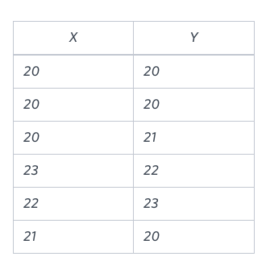
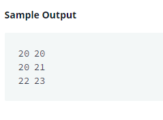

### Q:
- You are given a table, Functions, containing two columns: X and Y.
- Two pairs (X1, Y1) and (X2, Y2) are said to be symmetric pairs if X1 = Y2 and X2 = Y1.

- Write a query to output all such symmetric pairs in ascending order by the value of X. List the rows such that X1 ≤ Y1.



### Solution
- if f.x == f.y means COUNT(f.x) > 1
```sql
SELECT f.x, f.y 
FROM functions f JOIN functions s ON f.x = s.y AND f.y = s.x 
GROUP BY f.x, f.y
HAVING COUNT(f.x) > 1 OR f.x < f.y
ORDER BY f.x;
```